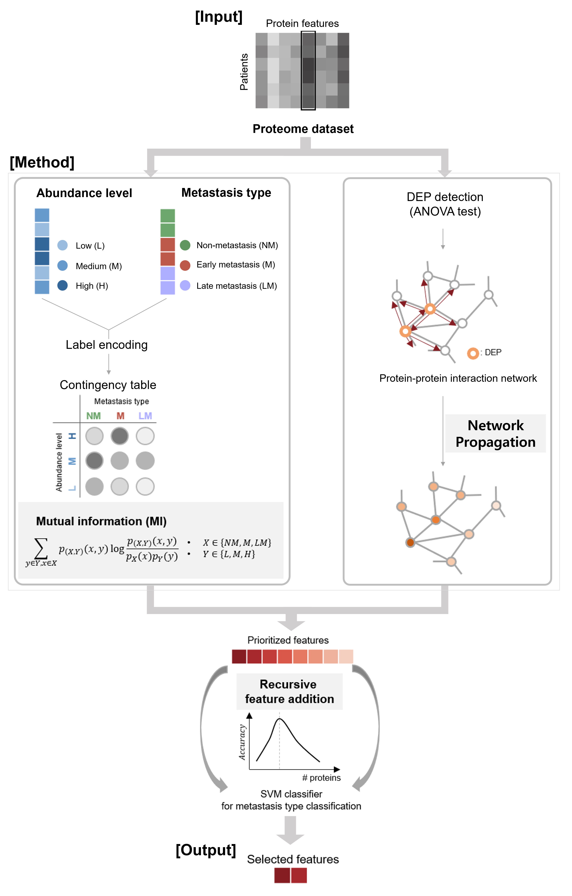

# ML_biomarker
Implementation of machine-learning based biomarker discovery tool. 

Original manuscript available [**here**](https://www.nature.com/articles/s41598-024-53015-1).

## Installation
```
conda create -n ML_biomarker python=3.9.13
conda activate ML_biomarker

conda update -n base -c defaults conda
pip install --upgrade pip
```
Install requirements and dependencies via:
```
pip install -r requirements.txt
```

## Biomarker discovery
- Input: data (Sample X feature matrix in tsv format), label (Sample X 2 matrix in tsv format), data_split (Sample X 3 matrix in tsv format)
- Output: Number of selected features, Selected genes (i.e. biomarker candidate), Max accuracy in recursive feature addition, Predicted label in test set, True label in test set
```
python bin/recursive_feature_addition.py -data data/Asthma/MS_LFQ.tsv -label data/Asthma/patient_label.tsv -data_split data_split/Asthma_CV_1.tsv -outDir result_Asthma_CV_1
```

## Citation
```
@article{koh2024identification,
  title={Identification of VWA5A as a novel biomarker for inhibiting metastasis in breast cancer by machine-learning based protein prioritization},
  author={Koh, Jiwon and Jeong, Dabin and Park, Soo Young and Han, Dohyun and Kim, Da Sol and Kim, Ha Yeon and Kim, Hyeyoon and Yang, Sohyeon and Kim, Sun and Ryu, Han Suk},
  journal={Scientific Reports},
  volume={14},
  number={1},
  pages={2459},
  year={2024},
  publisher={Nature Publishing Group UK London}
}
```
